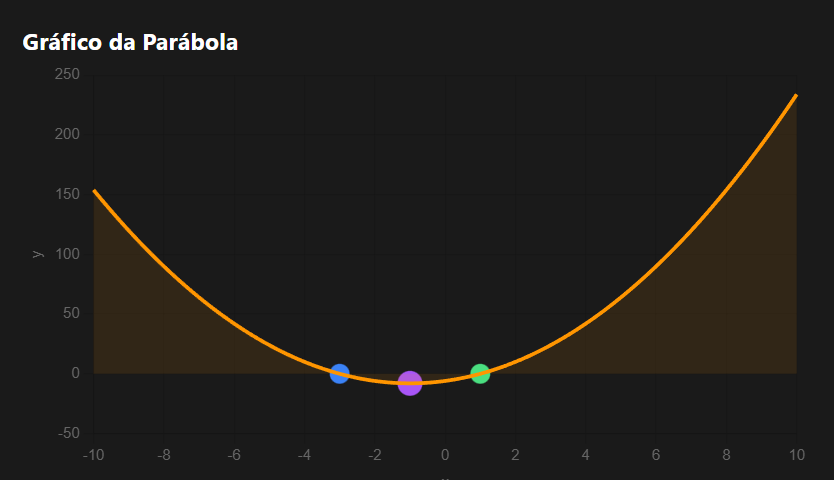

# 🧠 Resolutor de Equações Quadráticas

Este sistema web interativo foi projetado para ser um **Guia de Uso Rápido** para **calcular as raízes** de qualquer equação de segundo grau, **visualizar a parábola** correspondente e **aprender** sobre o processo matemático de forma clara e interativa.

---

## ✨ Objetivo Principal

Calcular as raízes de qualquer equação de segundo grau ($ax^2 + bx + c = 0$).

---

## 🚀 Tutorial de Uso

Este guia o auxiliará a usar as principais funcionalidades do Resolutor.

### I. Insira os Coeficientes

O primeiro passo é fornecer os dados da sua equação nos campos de entrada:

* **Localize os campos de entrada:** O aplicativo possui três campos principais para os coeficientes numéricos:
    * **Coeficiente a (≠ 0):** O primeiro termo da equação.
    * **Coeficiente b:** O segundo termo da equação.
    * **Coeficiente c:** O termo constante.
* **Digite os valores:** Insira os valores numéricos dos coeficientes da sua equação em cada campo.
    > *Exemplo:* Se sua equação tem os números 2, 4 e -6, você inserirá **2** no campo 'a', **4** no campo 'b' e **-6** no campo 'c'.
* **Opção de Voz:** Se preferir, clique no botão **Usar Voz** para inserir os valores falando os números (exemplo: "a igual a 2, b igual a 4, c igual a menos 6").

### II. Resolva e Veja o Resultado

Após inserir todos os coeficientes, inicie o cálculo:

1.  **Ação de Cálculo:** Clique no botão principal: **Calcular Equação**.
2.  **Resultado Imediato:** O aplicativo processará os valores e exibirá as raízes encontradas (os resultados 'x').

### III. Aprenda com a Explicação Detalhada

Use esta funcionalidade para entender o processo matemático por trás do resultado.

1.  **Acesso à Explicação:** Após calcular, a **Explicação do Cálculo** será gerada.
2.  **Conteúdo Exibido:** Uma nova seção será aberta, mostrando o passo a passo completo, detalhando:
    * O cálculo do discriminante.
    * A natureza das raízes (se são reais ou complexas).
    * O método utilizado para encontrar os valores de 'x'.

### IV. Visualize a Parábola

Veja a representação gráfica da sua equação.

1.  **Acesso ao Gráfico:** O **Gráfico da Parábola** estará visível abaixo da Explicação de Cálculo.
2.  **Análise Visual:** Um gráfico será gerado no plano cartesiano. Observe a curva (a parábola) e verifique se os pontos em que ela cruza a linha horizontal (o eixo x) correspondem aos resultados que você calculou na etapa II.

### V. Gerenciamento e Histórico

Utilize as ferramentas de controle para novas operações ou consultas de dados antigos.

* **Limpar:** Para começar uma nova equação, clique em **Limpar Tudo**. Isso apagará todos os coeficientes e resultados da tela.
* **Histórico:** Desça até a seção **Histórico de Cálculos** para rever e consultar todas as equações que você resolveu na sua sessão atual.

---

## 💻 Como Acessar o Projeto

Você tem duas opções para usar o Resolutor de Equações Quadráticas:

1.  **Acesso Online (Recomendado):**
    * Clique no link direto para o site: **https://ghostdev-creator.github.io/Calculadora/**
2.  **Execução Local:**
    * Baixe o repositório completo para o seu computador.
    * Localize o arquivo principal (geralmente **`index.html`**).
    * **Abra o arquivo `index.html`** diretamente no seu navegador de internet (Chrome, Firefox, Edge, etc.).

---

## 👥 Desenvolvedores

| Nome | GitHub |
| :--- | :--- |
| **João Guilherme - GhostDev** | [@GhostDev-Creator](https://github.com/GhostDev-Creator) |
| **Laura Lopes** | [@lauralopes211](https://github.com/lauralopes211) |

---

## 🤝 Contribuição

Devido às restrições de licenciamento, contribuições externas (Pull Requests) **não serão aceitas** neste projeto. Para relatar bugs ou sugerir melhorias, por favor, abra uma **Issue**.

---

## 🔒 Licença - Uso e Comercialização Restritos

O código-fonte e toda a documentação deste projeto são **Propriedade Intelectual** dos desenvolvedores listados acima e estão sujeitos às seguintes restrições:

1.  **Proibição de Cópia e Distribuição:** É estritamente proibida a cópia, modificação ou distribuição integral ou parcial deste código-fonte sem autorização expressa por escrito dos desenvolvedores.
2.  **Proibição de Comercialização:** É estritamente proibido o uso, venda ou qualquer outra forma de exploração comercial deste software por terceiros.
3.  **Uso Pessoal:** Este software é disponibilizado **apenas para uso pessoal e educacional**.

Qualquer violação destas restrições estará sujeita às sanções legais cabíveis.

---
